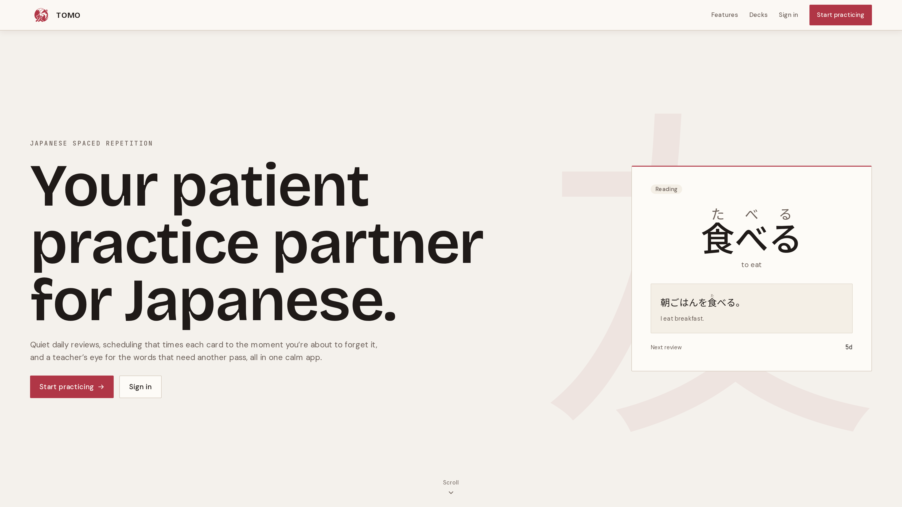
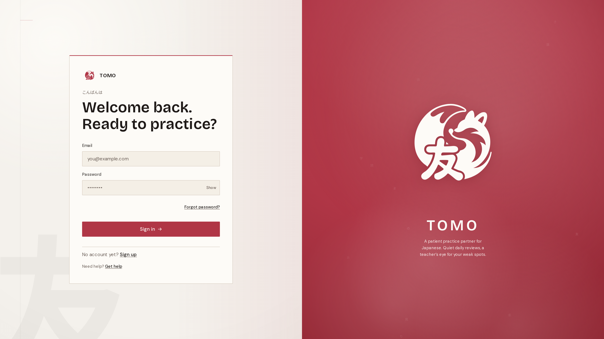
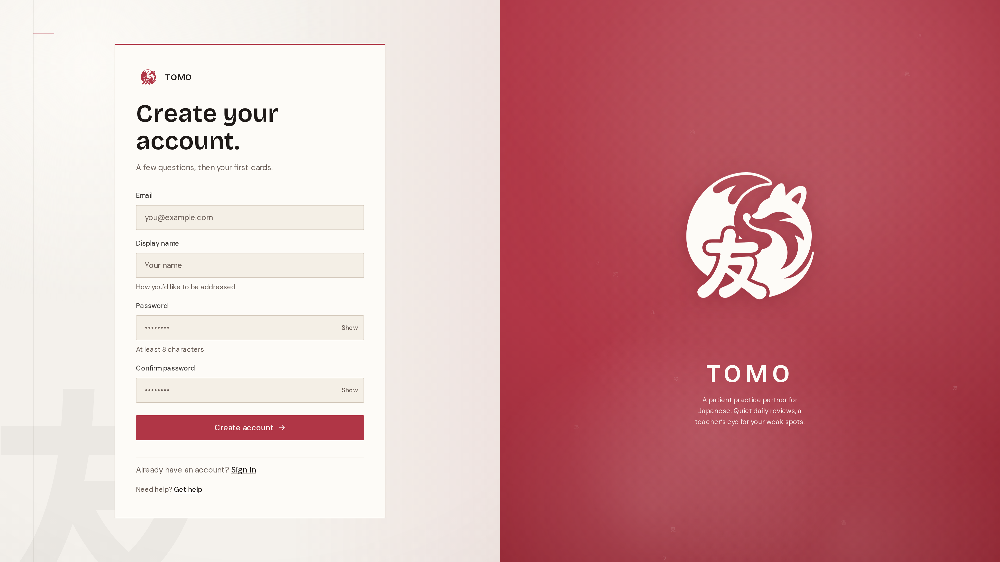

# Tomo 友

A spaced-repetition practice app for Japanese learners — FSRS v5 scheduling with OpenAI-backed card generation, personalized mnemonics, contextual example sentences, and a weak-spot diagnostic engine, all in one self-contained app.

## Demo



| | |
|---|---|
|  |  |

## Features

- **FSRS v5 scheduling** — the modern free spaced-repetition algorithm (the one Anki users now opt into), tuned to a `0.88` retention target and applied uniformly across every card type
- **AI card generation** — submit a Japanese word or phrase; Tomo produces reading, meaning, pitch accent, kanji breakdown, part-of-speech, and JLPT level automatically via structured GPT output
- **Personalized example sentences** — AI-written sentences that fit the learner's stated interests, with furigana and English translation
- **AI mnemonics** — one-off memory hooks generated on demand per card
- **Weak-spot diagnosis** — after a string of Again ratings on a pattern, Tomo runs a diagnostic pass and surfaces a plain-language explanation of what's going wrong and what to drill next
- **Daily review session** — keyboard-first review flow (1–4 to rate, space/enter to reveal, escape to pause); no mouse required
- **Premade JLPT decks** — vocabulary decks for N5 through N1, ready to subscribe and start from zero
- **Insights dashboard** — retention curves, forecast heatmap, streak calendar, and per-deck statistics
- **Offline review** — reviews buffer locally and sync on reconnect via Upstash Redis retry queue
- **Full accessibility** — WCAG 2.1 AA, `prefers-reduced-motion` honored end-to-end, full keyboard navigation, `lang="ja"` on all Japanese content, `<ruby>`/`<rt>` furigana for screen readers

## Tech Stack

**Frontend:** Next.js 15 (App Router), TypeScript (strict), Tailwind CSS, TanStack Query v5, Zustand 5  
**Backend:** Express 5, TypeScript, Pino logging, circuit breaker, idempotency, graceful shutdown  
**Database:** Supabase (PostgreSQL + pgvector), Row Level Security on every table  
**Cache / Queue:** Upstash Redis — AI response cache, rate limiting, offline review buffer  
**AI:** OpenAI `gpt-5.4-nano` (card generation, sentences, mnemonics, weak-spot diagnosis)  
**SRS Algorithm:** [ts-fsrs](https://github.com/open-spaced-repetition/ts-fsrs) — FSRS v5  
**Monorepo:** Bun workspaces  
**Deployment:** Vercel (web), Railway (API)

| Layer | Technology |
|---|---|
| Frontend | Next.js 15, TypeScript, Tailwind CSS |
| Client state | Zustand 5 |
| Server state | TanStack Query v5 |
| Backend | Express 5, TypeScript |
| Database | Supabase (PostgreSQL) |
| Vector search | pgvector (`<=>` cosine distance) |
| Cache / rate limiting | Upstash Redis |
| AI | OpenAI gpt-5.4-nano |
| SRS algorithm | ts-fsrs (FSRS v5) |
| Package manager | Bun (workspaces) |

## Motivation

Japanese learners end up juggling three categories of tool and none of them talk to each other.

**Anki** has a modern algorithm (it now ships FSRS) but no AI and no warmth. The cards you make are only as good as the time you have to make them well. **ChatGPT** can write personalized sentences and explain grammar but doesn't schedule reviews, doesn't track retention, and doesn't know what you're working on. **Companion apps** (Migaku, jpdb, MaruMori) split the difference but typically compromise on algorithmic depth, AI quality, or design craft.

Tomo's premise is integration: a single tool that ships modern FSRS, AI-as-teacher, and considered design under one roof. Switching context between three apps is friction, and friction is the daily-practice-killer Tomo exists to remove.

## Getting Started

### Prerequisites

- [Bun](https://bun.sh) v1.3.14 or later
- [Supabase CLI](https://supabase.com/docs/guides/cli) (for local database)
- A Supabase project (PostgreSQL + pgvector)
- An Upstash Redis database
- An OpenAI API key

### Installation

```bash
git clone https://github.com/seborja/japanese-fsrs.git
cd japanese-fsrs
bun install
```

### Environment variables

**`apps/api/.env`**
```
PORT=3001
NODE_ENV=development
SUPABASE_URL=
SUPABASE_SERVICE_ROLE_KEY=
UPSTASH_REDIS_REST_URL=
UPSTASH_REDIS_REST_TOKEN=
OPENAI_API_KEY=
CORS_ORIGIN=http://localhost:3000
```

**`apps/web/.env.local`**
```
NEXT_PUBLIC_API_URL=http://localhost:3001
NEXT_PUBLIC_SUPABASE_URL=
NEXT_PUBLIC_SUPABASE_ANON_KEY=
NEXT_PUBLIC_SITE_URL=http://localhost:3000
```

### Database

```bash
supabase start          # start local Supabase
supabase db push        # apply migrations
```

### Running locally

```bash
bun dev                 # web on :3000 + API on :3001, in parallel
```

Or individually:

```bash
bun run --filter @fsrs-japanese/web dev   # Next.js on :3000
bun run --filter @fsrs-japanese/api dev   # Express on :3001
```

## Commands

```bash
bun dev                  # run both apps in development
bun run build            # production build (both apps)
bun test                 # API test suite (Bun runner)
bun run --filter @fsrs-japanese/web test            # web unit tests (Vitest + MSW)
bun run --filter @fsrs-japanese/web test:coverage   # with coverage thresholds
bun run typecheck        # tsc across all packages
bun run lint             # eslint, zero warnings allowed
bun run lint:fix         # auto-fix
bun run db:types         # regenerate Supabase TypeScript types
```

## Repository Structure

```
japanese-fsrs/
├── apps/
│   ├── web/                    Next.js 15 frontend (App Router)
│   │   ├── app/
│   │   │   ├── (app)/          Authenticated product routes
│   │   │   ├── (auth)/         Sign-in, sign-up, forgot-password
│   │   │   ├── (marketing)/    Public landing page
│   │   │   └── onboarding/     First-run wizard
│   │   ├── components/         Shared design-system components
│   │   ├── lib/api/            TanStack Query hooks + fetch client
│   │   ├── stores/             Zustand — review session state
│   │   └── hooks/              Reusable client hooks
│   └── api/                    Express 5 REST API
│       └── src/
│           ├── routes/         Path → controller mapping
│           ├── controllers/    Request parsing, response sending
│           ├── services/       Business logic and DB queries
│           │   └── ai/         Per-generator AI modules
│           ├── middleware/      Auth, rate limiting, error handler
│           └── db/             Supabase + Redis clients
├── packages/
│   ├── shared-types/           Shared Zod schemas + domain types
│   └── tsconfig/               Shared TypeScript base config
└── supabase/
    └── migrations/             Forward-only SQL migrations
```

## Architecture

All routes are under `/api/v1/`. The API uses a strict three-layer architecture — **routes → controllers → services** — where business logic never leaks into route handlers or controllers.

AI generators live in isolated modules under `apps/api/src/services/ai/` (one file per generator: `card.ts`, `sentences.ts`, `mnemonic.ts`, `diagnosis.ts`, `tomo-note.ts`, `day-reflection.ts`). Structured generators run at low temperature with a fixed seed and validate output through a corrective `parseWithRepair` pass. Creative generators run warm for variety.

The frontend calls the Express API for all data. Supabase is only touched client-side for auth session management. Review session state lives entirely in Zustand; TanStack Query handles all server-derived data.

## Design

Tomo's visual identity is built around a **kitsune** (Japanese fox) mark in **Inari Vermillion `#B03646`** — the color of Inari shrine torii gates, far from the indigo/purple/green defaults of the SaaS-product lane. The type system pairs **Bricolage Grotesque** (display) with **DM Sans** (body) and **Noto Sans JP** for Japanese content.

Three words define the brand voice: **encouraging, considered, joyful.** Joy is structural, not decorative — it shows up in the cadence of motion, the choice of words, the framing of progress, and the kindness of empty states. The AI is invisible: no sparkle icons, no "AI-powered ✨" badges, no generated-by footers. Learners experience sharper cards and more personal sentences; they don't experience a labeled chatbot.

## License

MIT
